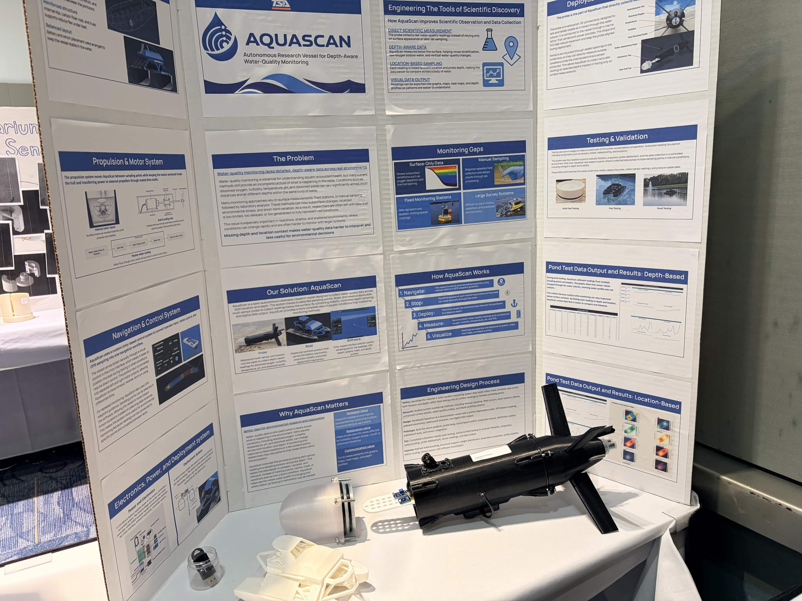
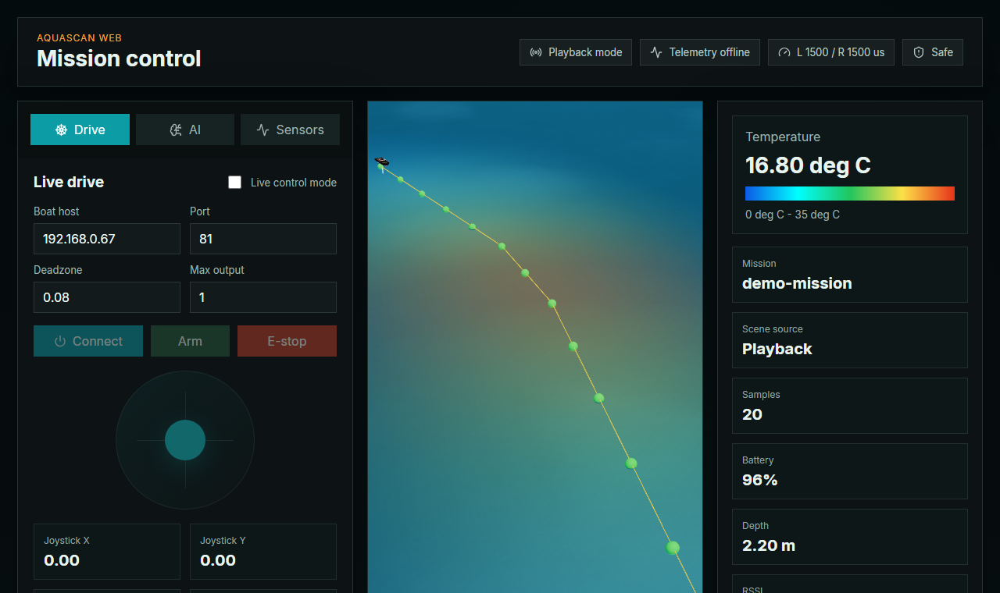
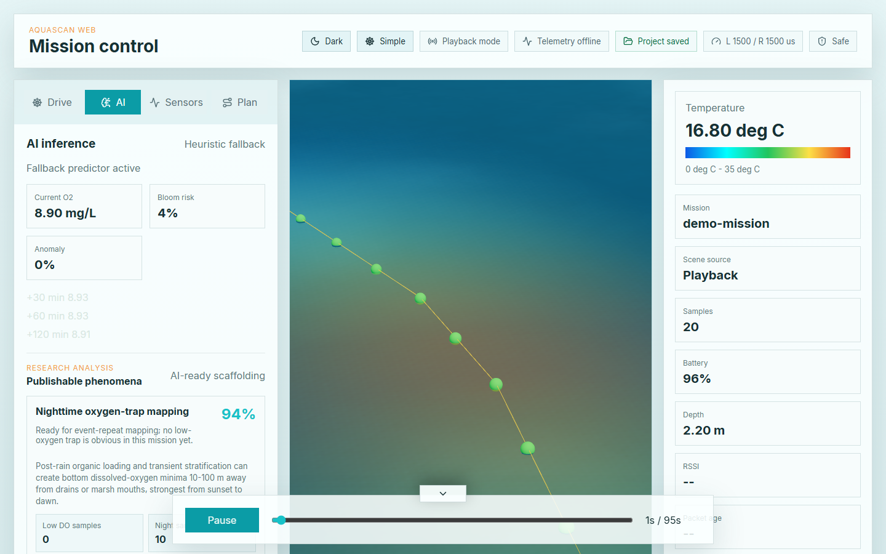
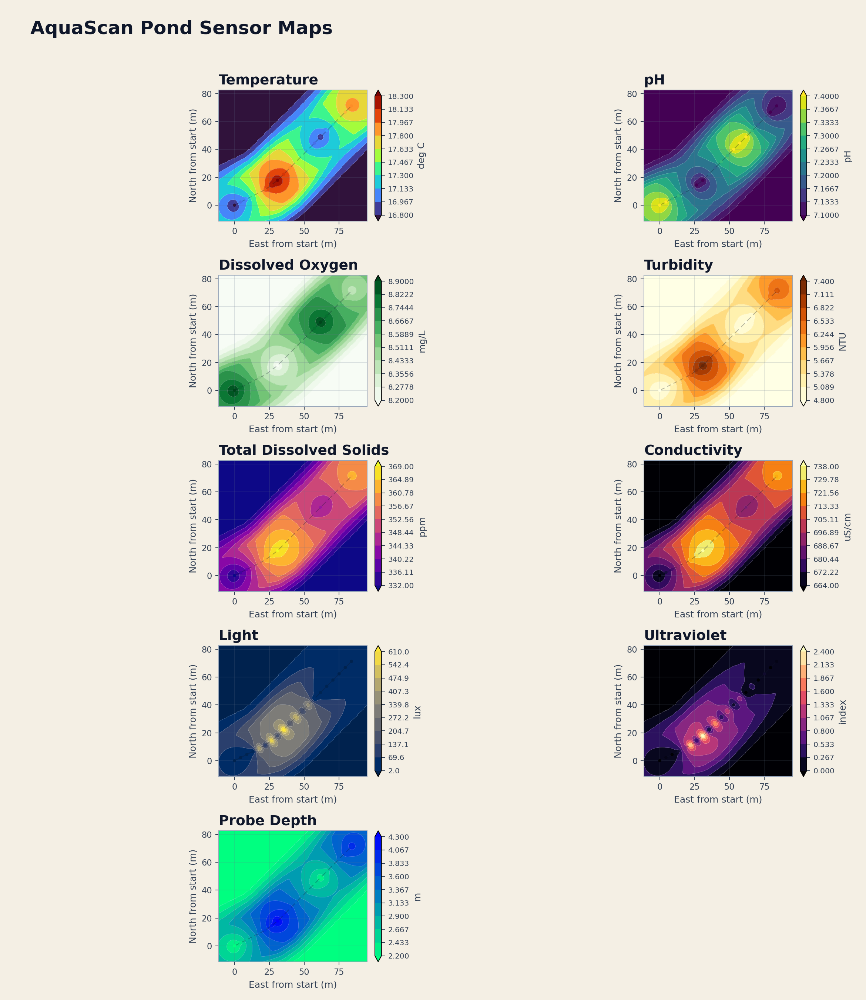

# AQUAScan

AQUAScan is an autonomous research vessel and data platform for depth-aware
water-quality monitoring. The project combines a deployable probe, live boat
control, mission review, sensor mapping, firmware, and an ML pipeline for
turning field measurements into useful environmental insight.



## What It Does

- Collects location-tagged water-quality samples from a small surface vessel.
- Maps temperature, pH, dissolved oxygen, turbidity, conductivity, light,
  ultraviolet, depth, speed, and battery data.
- Provides a browser dashboard for mission playback, telemetry, planning, and
  live control.
- Uses ESP32 and Arduino firmware to bridge Wi-Fi commands to motor and probe
  hardware.
- Trains and exports a first-pass water-quality model for oxygen forecasting,
  bloom-risk scoring, and anomaly detection.

## Dashboard



The `web/` app is the main control and visualization surface. It supports mission
CSV/JSON loading, timeline playback, telemetry panels, sensor layers, planning
tools, heuristic AI fallback predictions, Firebase-protected control, and direct
WebSocket operation.

```powershell
cd web
npm install
npm run dev
```

Useful checks:

```powershell
npm run test
npm run build
npm run lint
```

## Analysis Views



The dashboard includes mission review and AI-ready analysis panels for dissolved
oxygen, bloom risk, anomaly flags, forecast windows, and publishable phenomena
notes.

## Sensor Mapping



Mission data can be visualized as sensor maps and operational graphs for pond or
pool test runs. These outputs make it easier to compare water-quality conditions
across location, depth, and time.

## Repository Layout

```text
aquascan-relay/          Cloudflare Worker relay for public WebSocket control
docs/images/             GitHub README images
EngineeringDesignAQUASCAN/
                         engineering design boards, photos, and analysis assets
Firmware/                ESP32 and Arduino sketches
ML/                      Python training, data loading, tests, exported artifacts
PortfolioAreaGraphs/     generated pond-area sensor maps
PortfolioGraphs/         generated sensor and operations graphs
Tools/                   portfolio graph and workbook generation scripts
web/                     React/Vite dashboard and public project site
```

## Firmware

Primary firmware entry points:

- `Firmware/ESP32/AQUAScanESP32/AQUAScanESP32.ino`
- `Firmware/ESP32/AQUAScanSensors/AQUAScanSensors.ino`
- `Firmware/Arduino/AQUAScanEscBridge/AQUAScanEscBridge.ino`

Live-control topology:

```text
web dashboard -> WebSocket -> ESP32 -> Serial2 -> Arduino Mega -> ESCs
```

Default control settings:

- ESP32 WebSocket endpoint: `ws://<esp32-ip>:81/`
- ESC neutral: `1500` microseconds
- ESC reverse range: `1000-1499`
- ESC forward range: `1501-2000`
- command send rate: `20 Hz`
- safety timeout: `300 ms`

Before field testing, confirm Wi-Fi credentials, serial pin assignments, shared
ground, neutral pulse output, and E-stop behavior with motors disconnected.

## ML Pipeline

The `ML/` folder trains a multi-task model from mission files and synthetic data.

```powershell
cd ML
pip install -r requirements.txt
python -m aquascan_ml.train --epochs 3 --synthetic-missions 12 --mission-dir ..\web\public\missions
```

Artifacts are written to `ML/artifacts/`, including:

- `aquascan_multitask.pt`
- `aquascan_multitask.onnx`
- `normalization.json`
- `metrics.json`
- `prediction_sample.csv`

Run the Python checks with:

```powershell
cd ML
pytest
```

## Mission Data

CSV missions should include:

```text
timestamp,latitude,longitude,temperature,ph,do,salinity,tds,conductivity,turbidity,light,uv,depth,heading,speed,battery
```

JSON missions use a `missionName` and `samples` array. Each sample includes a
timestamp, latitude, longitude, and `metrics` object.

## Safety Notes

Live-control code defaults to disarmed startup, neutral-on-timeout behavior, and
latched E-stop handling. Treat this as a software safeguard only: validate ESC
pulses, wiring, power isolation, and mechanical safety procedures on the bench
before operating the vessel near people or fragile equipment.
